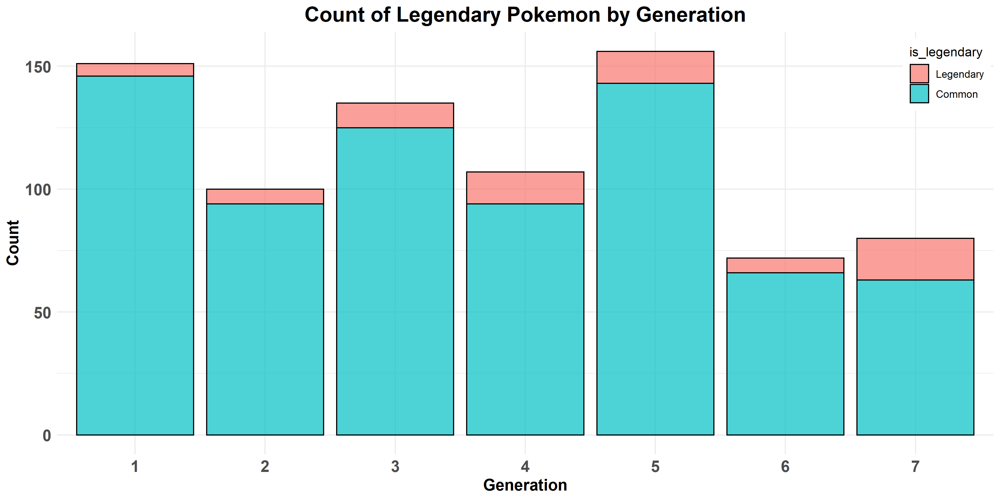

```{r setup, include=FALSE}
knitr::opts_chunk$set(
  echo = FALSE
)
```

## Pokemon Prediction 

I keep seeing an add from DataCamp's project [**What Makes a Pokémon Legendary?**](https://www.datacamp.com/projects/712) ... Instead of paying for it I decided to see if I can do the same type of analysis with the `tidymodels` workflow.

## Set Up 

We will primarily be using the the `tidyverse` and `tidymodels` packages, so if you don't have those installed just run the `install.packages()` functions below. 

__Required Packages__:

```r
# If not installed unncomment below and run
# install.packages("tidyverse", dependencies = TRUE)
# install.packages("tidymodels", dependencies = TRUE)

# if installed load
library(tidyverse)  # plotting and data manipulation
library(tidymodels) # tidy model framework
```

## Data

I have saved a version of the Pokemon data set in my repository that you can pull into your environemnt using the following code.

```r
pokemon_df <- read_csv(
  "https://raw.githubusercontent.com/Jordan-Krogmann/pokemon/master/data/pokemon.csv"
  ) %>%
  as_tibble() %>%
  mutate(
    type2 = case_when(
      is.na(type2) ~ "none",
      TRUE ~ type2
    )
  ) %>%
  mutate(
    two_types_flag = case_when(
      type2 == "none" ~ 0,
      TRUE ~ 1
    )
  )
```


## EDA

The objective here is to enventually build a series of models that will predict the likelihood of the pokemon being legendary.  The figure below shows the count of legendary pokemon through each generation.




## Modeling

put stuff here

